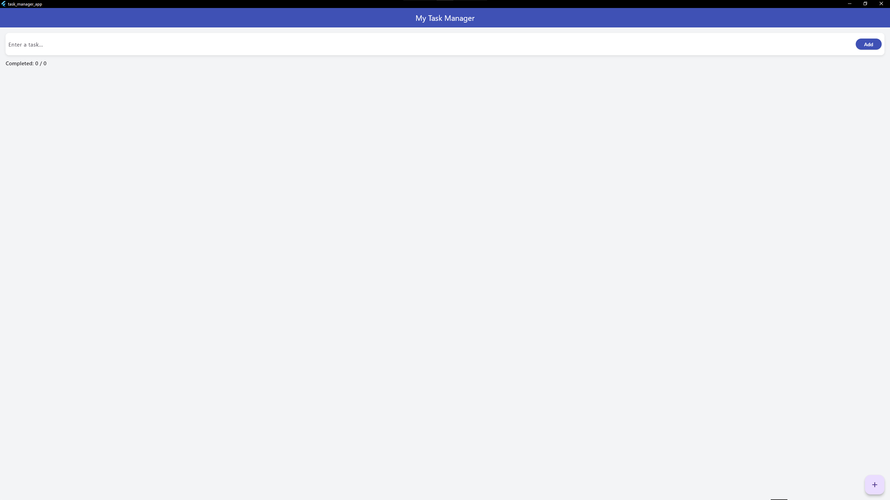
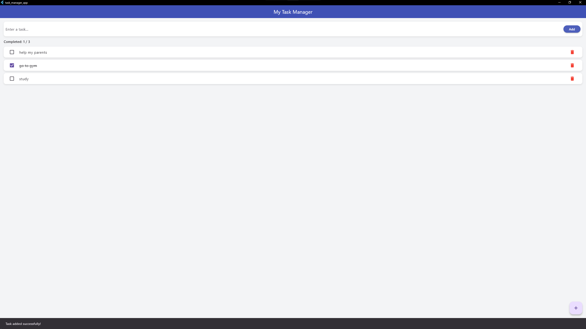

<<<<<<< HEAD
# 🧩 Task Manager App


A clean and simple Flutter task management app built by **Omar Mosab Idrees Idrees**.  
This app allows users to add, mark, and delete daily tasks — with automatic data saving using `shared_preferences`.

---

## 🚀 Features
- ✅ Add new tasks easily  
- 🗑️ Delete tasks instantly  
- ☑️ Mark tasks as completed (with line-through style)  
- 💾 Automatic data saving — tasks persist after closing the app  
- 💙 Modern UI with a **blue theme** and smooth layout  
- ⚡ Includes a custom Splash Screen and app icon  

---

## 🛠️ Technologies Used
- **Flutter 3.35.7**  
- **Dart SDK 3.9.2**  
- **Shared Preferences Plugin**  
- **Material Design Components**

---

## 📸 Screenshots

Below are the app’s real interface images taken from the running Flutter web version:

### 🏠 Home Screen  


### ➕ Add Task  


### ✅ Completed Task  


---

## 📦 Installation Guide

1️⃣ Clone this repository  
`git clone https://github.com/yourusername/task_manager_app.git`  

2️⃣ Navigate to the project folder  
`cd task_manager_app`  

3️⃣ Get dependencies  
`flutter pub get`  

4️⃣ Run the app  
`flutter run -d chrome`  

---

## 📁 App Structure
```
lib/
 ├─ main.dart           # Main entry point (includes Splash + HomePage)
 ├─ splash_screen.dart  # Splash Screen (loads app)
 └─ home_page.dart      # Task management UI and logic

assets/
 ├─ icon.png                # App Icon
 ├─ screenshot_home.png     # Home page screenshot
 ├─ screenshot_add.png      # Add task screenshot
 └─ screenshot_done.png     # Completed task screenshot
```

---

## 👨‍💻 Developer
**Omar Mosab Idrees Idrees**  
📧 [oidrees321@gmail.com](mailto:oidrees321@gmail.com)  
📱 +970 595509087  

---

⭐ *If you like this project, give it a star on GitHub!*  
🔗 [View Project Repository](https://github.com/yourusername/task_manager_app)
=======
# task_manager_app
>>>>>>> 08f0703af55572ee1a894540d6248b4897d39e72
